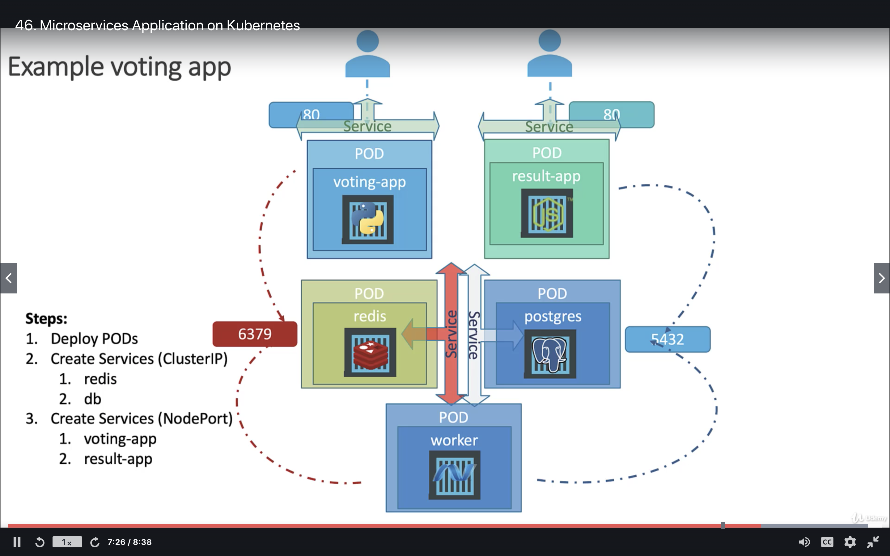

# Example Microservice

Build the architecture of the voting/result app as specified by this diagram.



In the first iteration we build 5 pods. Each with the specifed images.

We then build 4 services, 2 clusterIPs and 2 nodePorts.

Let's try this.

Dump all the files into this directory.


# Setup

Create the voting app like this

```BASH
kubectl create -f voting-app-pod.yaml
```

Create the nodeport for this service

```BASH
kubectl create -f voter-node-port.yaml
```

You should now be able to see the front end app. To find the URL go to

```BASH
 minikube service voting-node-port  --url
```

You should see the front end, but it will crash if you click one of the option, because we do not yet have the redis component.

Create the redis bit:

```BASH
kubectl create -f redis-cluster-ip.yaml

```

Now you should be able to click on one of the choices without crashing the front
end.

Now build the other front end container, the result app.

```BASH
kubectl create -f result-app-pod.yaml

```

Now create the nodeport for this front-end component.

```bash
kubectl create -f result-node-port.yaml

```

Run the command:

```Bash
 minikube service result-node-port  --url

```

You should now see the results. But of course they will not yet update.

